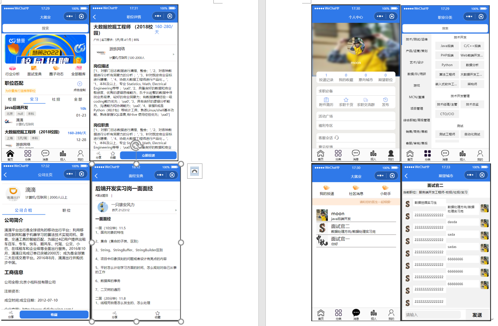

## 项目背景
该小程序集求职和招聘为一体，主要功能包括招聘信息的推荐与分类，即时通讯，职位搜索，面经题库展示，简历上传和下载，职位的发布与审核

## 运行截图

## 部署运行

### 一、微信小程序端

dajiuye-mp-boot

使用微信开发者工具导入dajiuye-mp即可运行

### 二、Java后端

dajiuye-backend-boot

1、导入数据库，并更改数据库地址

2、redis地址，mysql地址

3、即可启动

### 三、Web管理系统

dajiuye-manage-system

## 技术选型

### 后端技术

SpringBoot+WebSockket+Redis+SpringSecurity+JWT 

1、使用Token机制+Redis（Lua）解决了接口幂等性问题，使用SpringSecurity控制资源访问权限 

2、基于WebSocket和Stomp协议搭建起聊天室，并基于RabbitMQ对聊天消息异步持久化

3、基于Redis缓存热点职位，并使用分布式锁Redisson解决缓存击穿问题，并搭建Redis-Cluster集群提高扩展性和可用性

| 技术        | 版本    | 说明                            |
| ----------- | ------- | ------------------------------- |
| Spring Boot | 2.7.1   | MVC核心框架                     |
| MyBatis     | 3.3.1   | ORM框架                         |
| redis       | 6.0.0   | 缓存                            |
| hikari      | 5.0.1   | 数据库连接池                    |
| logback     | 1.4.5   | log日志工具                     |
| lombok      | 1.18.26 | 简化对象封装工具                |
| redisson    | 3.19.3  | 对redis进行封装、集成分布式锁等 |
|             |         |                                 |
|             |         |                                 |
|             |         |                                 |
|             |         |                                 |
|             |         |                                 |
|             |         |                                 |

### 前端技术

vue3+ts

微信小程序开发

## 演示视频

https://www.bilibili.com/video/BV1AV4y127tT

## 其他版本

分为三个版本：

springboot版本：https://github.com/linhuanfeng/dajiuye-boot

dubbo版本：https://github.com/linhuanfeng/dajiuye-dubbo

springcloud版本：https://github.com/linhuanfeng/dajiuye-cloud

## 反馈与答疑

最后的最后，如果你部署遇到任何疑问，欢迎添加**扣扣**咨询群【417094004】或**微信号**【moon5672369】咨询！开源不易，一定要给我==Star==哦！！

如果是初学Java的朋友也可以跟着流程借鉴这些代码，试着实现这个项目，相信能对你的成长有所帮助！

如果有心，不妨请博主喝杯茶::laughing::

