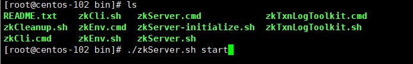
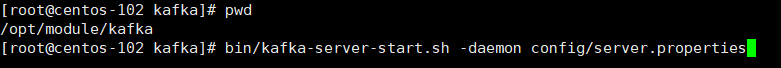
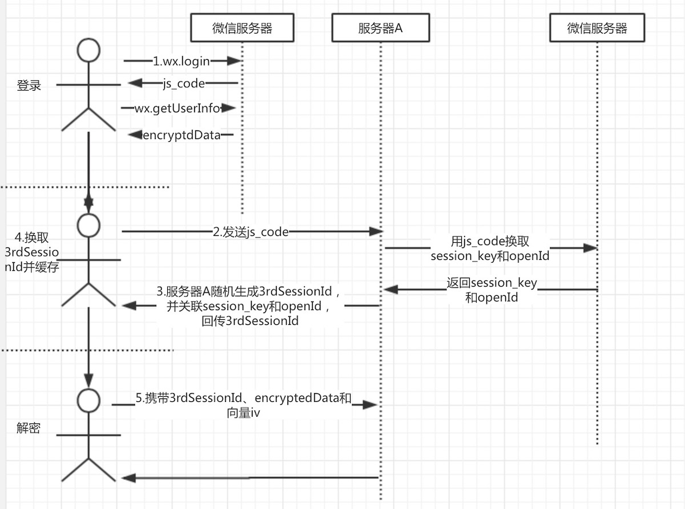
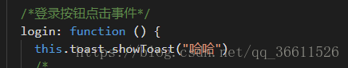

# 大就业

### swagger

http://localhost:8080/swagger-ui/index.html

### 模块依赖关系

api不需要依赖别的模块

common也不要依赖别的模块


api-->common

common-security-->api


改成common-security-->api 单项依赖

其它所有service-->common,api

### 部署启动

#### redis

```
docker run --restart=always --log-opt max-size=100m --log-opt max-file=2 -p 6379:6379 --name myredis -v /home/redis/myredis/myredis.conf:/etc/redis/redis.conf -v /home/redis/myredis/data:/data -d redis redis-server /etc/redis/redis.conf  --appendonly yes  --requirepass 000415

docker run -d -p 6380:6379 redis
```


#### Mysql

```
docker run  --restart=always  --name mysql8.0  -v /opt/module/mysql8/conf:/etc/mysql/conf.d -v /opt/module/mysql8/data:/var/lib/mysql -p 3308:3306  -e MYSQL_ROOT_PASSWORD='weiwenping'   -d mysql:8.0
```


#### RabbitMq

```
docker pull rabbitmq

docker run -d --hostname my-rabbit --name rabbit -p 15672:15672 -p 5673:5672 rabbitmq
```

#### zookeeper

安装看D:\资料\zookeeper\笔记



#### kafka

```
bin/kafka-server-start.sh -daemon  config/server.properties
```



### swagger

springboot 2.6.5 ✚ swagger 3.0.0配置属下

```
<parent>
	<groupId>org.springframework.boot</groupId>
	<artifactId>spring-boot-starter-parent</artifactId>
	<version>2.6.5</version>
</parent>
<dependency>
	<groupId>io.springfox</groupId>
	<artifactId>springfox-boot-starter</artifactId>
	<version>3.0.0</version>
</dependency>

```

application.yml 或applicaiton.properties 中添 必须 加如下配置

```
spring:
  mvc:
    pathmatch:
      matching-strategy: ant_path_matcher
```

只需要在启动类上加 `@EnableSwagger2` 注解即可
访问地址：http://127.0.0.1:88/swagger-ui/index.html

注解说明

```
@Api : 用在类上，说明该类的主要作用。

@ApiOperation：用在方法上，给API增加方法说明。

@ApiImplicitParams : 用在方法上，包含一组参数说明。

@ApiImplicitParam：用来注解来给方法入参增加说明。

@ApiResponses：用于表示一组响应。

@ApiResponse：用在@ApiResponses中，一般用于表达一个错误的响应信息

@ApiModel：用在返回对象类上，描述一个Model的信息（一般用在请求参数无法使用@ApiImplicitParam注解进行描述的时候）

@ApiModelProperty：描述一个model的属性
```

### 项目介绍

#### 1、如何缓存热点职位

hash结构存储职位所有信息

zset结构保存职位的热度

定期将zset中低热度的内容从hash中清除掉

使用淘汰策略，lru清除冷门数据

#### 2、热点职位

ZSet：job:hot     key(jobId)   score(时间戳+点击量)

Hash：job:entity    key(jobId)   value(jobEntity)


用户行为：浏览职位，投递职位

kafka对应三个话题：job-browse   job-delivery

每种都会增加职位的热度：一小时毫秒数，2小时


**如果一个用户点赞，那么****5****分钟内就不能在点赞了**

**新发布的职位也会缓存，****zset—****当前时间戳**

**Hset: jobId : jobEntity**

**Zset: jobId: timestamp+click** **以时间戳****+****浏览次数（每次加三分钟对应的秒数）**

#### 3、SpringSecurity逻辑

（1）重写 UsernamePasswordAuthenticationFilter的认证成功方法，生成token并把权限列表保存在redis;另外这里也可以自定义登录路径。

（2）重写BasicAuthenticationFilter的doFilterInternal授权方法，改为从根据token从redis中获取；

（3）在WebSecurityConfigurerAdapter添加自定义的过滤器；另外使用自定义的userDetailsService和PasswordEncoder

 

登录逻辑，先到health-acl进行登录服务，获取token（里面包含用户名，10分钟）

以后访问各个微服务，都要header都要携带token，不然访问失败

原理：在BasicAuthenticationFilter的doFilterInternal中，会根据token到redsis中获取权限列表，获取成功，放入到security上下文中

SecurityContextHolder.*getContext*().setAuthentication(authRequest)

#### 用户登录流程

调用接口

请求参数

后端逻辑：

（1）远程调用acl服务保存当前当前用户到acl-user（账号密码都是openid）,同时授予默认权限

（2）使用openId进行登录，同时返回token

返回当前用户

权限控制逻辑

（1）不登录也可以访问

（2）没有标注@PreAuth

需要先登录，但可以没有权限

（3）标注@PreAuth

要登录，并且有相应的权限

#### 接口幂等性

基于token机制+redis解决了页面重复提交问题

首先申请token，并把token存到redis中，页面请求的时候把在header中携带token,如果token存在则成功。然后先删除token，再保存数据。

先删Token还是先保存数据：采用先删token

如果保存数据失败，重新保存的时候只需要请求token即可

如果采用先保存数据，如果数据保存成功，删token删失败，那么还是会导致数据重复提交。

#### 聊天逻辑

再app.js中连接socket

message页面，订阅私人频道和公共频道

dialog页面：订阅私人频道，如果私人频道有消息且是当前对面，则队列增加消息。

在消息中在异步持久化

#### 用户信息解密



### dubbo依赖

```
<?xml version="1.0" encoding="UTF-8"?>
<project xmlns="http://maven.apache.org/POM/4.0.0" xmlns:xsi="http://www.w3.org/2001/XMLSchema-instance"
         xsi:schemaLocation="http://maven.apache.org/POM/4.0.0 https://maven.apache.org/xsd/maven-4.0.0.xsd">
    <modelVersion>4.0.0</modelVersion>

<!--    <parent>-->
<!--        <groupId>org.apache.dubbo.samples</groupId>-->
<!--        <artifactId>dubbo-spring-boot-service-introspection-zookeeper-samples</artifactId>-->
<!--        <version>2.7.10-SNAPSHOT</version>-->
<!--        <relativePath>../pom.xml</relativePath>-->
<!--    </parent>-->
    <parent>
        <groupId>org.springframework.boot</groupId>
        <artifactId>spring-boot-starter</artifactId>
        <version>2.3.0.RELEASE</version>
    </parent>

    <properties>
        <mybatisplus.version>3.3.1</mybatisplus.version>
    </properties>

    <groupId>com.lhf.dajiuye</groupId>
    <artifactId>dajiuye-job-service</artifactId>
    <version>0.0.1-SNAPSHOT</version>
    <name>dajiuye-job-service</name>
    <description>Demo project for Spring Boot</description>
    <dependencies>
        <!-- Spring Boot dependencies -->
        <dependency>
            <groupId>org.springframework.boot</groupId>
            <artifactId>spring-boot-starter</artifactId>
        </dependency>

        <dependency>
            <groupId>org.apache.dubbo</groupId>
            <artifactId>dubbo-spring-boot-starter</artifactId>
            <version>2.7.8</version>
        </dependency>

        <!-- Apache Zookeeper -->
        <dependency>
            <groupId>org.apache.zookeeper</groupId>
            <artifactId>zookeeper</artifactId>
            <version>3.4.8</version>
            <exclusions>
                <exclusion>
                    <groupId>org.slf4j</groupId>
                    <artifactId>slf4j-log4j12</artifactId>
                </exclusion>
            </exclusions>
        </dependency>

        <dependency>
            <groupId>org.apache.curator</groupId>
            <artifactId>curator-x-discovery</artifactId>
            <version>4.3.0</version>
        </dependency>

        <dependency>
            <groupId>com.alibaba</groupId>
            <artifactId>fastjson</artifactId>
            <version>1.2.53</version>
        </dependency>

        <dependency>
            <groupId>ch.qos.logback</groupId>
            <artifactId>logback-classic</artifactId>
        </dependency>
    </dependencies>

    <build>
        <plugins>
            <plugin>
                <groupId>org.apache.maven.plugins</groupId>
                <artifactId>maven-compiler-plugin</artifactId>
                <version>3.8.1</version>
                <configuration>
                    <source>1.8</source>
                    <target>1.8</target>
                    <encoding>UTF-8</encoding>
                </configuration>
            </plugin>
            <plugin>
                <groupId>org.springframework.boot</groupId>
                <artifactId>spring-boot-maven-plugin</artifactId>
                <version>2.3.7.RELEASE</version>
                <configuration>
                    <mainClass>com.lhf.dajiuye.job.service.DajiuyeJobServiceApplication</mainClass>
                </configuration>
                <executions>
                    <execution>
                        <id>repackage</id>
                        <goals>
                            <goal>repackage</goal>
                        </goals>
                    </execution>
                </executions>
            </plugin>
        </plugins>
    </build>

</project>

```


### app.js生命周期

```
　onLaunch 生命周期函数–监听小程序初始化 
　　当小程序初始化完成时，会触发 onLaunch（全局只触发一次）。

　　onShow  生命周期函数–监听小程序显示
　　当小程序启动，或从后台进入前台显示，会触发 onShow

　　onHide 生命周期函数–监听小程序隐藏
　　当小程序从前台进入后台，会触发 onHide

　　onError 错误监听函数
　　当小程序发生脚本错误，或者 api 调用失败时，会触发 onError 并带上错误信息
```

### 原生websocket

```
import {
    request
} from "../../requests/index.js";
Page({

    /**
     * 页面的初始数据
     */
    data: {
        userInfo: {},
        allMessage: [],
        isDisConnection:false//是否是手动断开锻炼
    },

    /**
     * 生命周期函数--监听页面加载
     */
    onLoad: function (options) {
        // this.startSetInter()
    },

    /**
     * 生命周期函数--监听页面显示
     */
    onShow: function () {
        const socketUrl = 'ws://127.0.0.1:9977/message-server/webSocketOneToOne/0/2'
        var that=this
        wx.connectSocket({
            url: socketUrl,
            success: function () {
                console.log('websocket连接成功~')
                wx.onSocketMessage((res) => {
                    //接收到消息
                    console.log("接收到消息" + JSON.stringify(res));
                })
                wx.onSocketOpen(() => {
                    console.log('WebSocket连接打开')
                    that.sendmsg()
                })
                wx.onSocketError((res) => {
                    console.log('WebSocket连接打开失败')
                    that.reconnect()
                })
                wx.onSocketClose((res) => {
                    console.log('WebSocket 已关闭！');
                    socketOpen = false;
                    if (that.data.isDisConnection) {
                        that.reconnect()
                    }
                })
            },
            fail: function () {
                console.log('websocket连接失败~')
            }
        })


        const userInfo = wx.getStorageSync('userInfo')
        if (!userInfo) {
            wx.switchTab({
                url: '../user/index', //注意switchTab只能跳转到带有tab的页面，不能跳转到不带tab的页面
            })
            wx.showToast({
                title: '请先登录',
                icon: 'none',
                image: '',
                duration: 1000,
                mask: false,
            });
            return;
        }
        this.setData({
            userInfo
        })
        this.setAllMessage(userInfo.openId)
    },

     /**
   * 生命周期函数--监听页面隐藏
   */
  onHide: function () {
    this.setData({
      isDisConnection:true
    })
    wx.closeSocket()
  },

    sendmsg(){
        console.log("准备发送消息")
        var message = {
            "msgContent": "asda",
            "targetId":"asdada"
          }
        wx.sendSocketMessage({
            data: JSON.stringify(message),
            success(res) {
              console.log("发送消息成功")
            },
            fail: function (e) {
                console.log(e)
                console.log("发送失败")
              }
          })
    },

    startSetInter: function () {
        var that = this;
        //将计时器赋值给setInter
        that.data.setInter = setInterval(
            function () {
                that.setAllMessage(that.data.userInfo.openId)
            }, 30000);
    },
    endSetInter: function () {
        var that = this;
        //清除计时器  即清除setInter
        clearInterval(that.data.setInter)
    },
    async setAllMessage(openId) {
        var that = this
        const result = await request({
            url: "/own/user/getAllMessage",
            data: {
                openId
            }
        });
        that.setData({
            allMessage: result
        })
    },
    setList(e) {
        console.log("hahah")
        console.log(e)
        wx.setStorageSync('msgs', this.data.allMessage[e.currentTarget.dataset.msgs])
        wx.navigateTo({ //---wx.  传当前页面的数据到另外一个页面！！！
            url: "/pages/dialog/index"
        })
    }
})
```

### 业务设计

#### 1、首页就是工作匹配，填好简历一键为你匹配职业；

#### 2、中间就是工作区，并加多一些筛选。

#### 3、我的 就基本没有变

#### 4、校招区 连list,list里面放校招图片，有筛选功能（右边弹出，有地区、字母排序），有搜索功能

#### 5、刷题区

### 小程序知识点

#### for循环

- ```html
  微信小程序的for循环的选项是item,下标是index。
  <view wx:for="{{arr}}">
     <text>{{index}}--- {{item}}</text>
  </view>
  也可以指定遍历选项和下标的别名，
  指定遍历选项的别名：wx:for-item="xxx"　
  指定遍历下标的别名 ：wx:for-index="yyy"
  <!-- 给遍历的item指定别名，给遍历的下标指定别名 -->
  <view wx:for="{{arr}}" wx:for-item="testItem" wx:for-index="i">
    <text>{{testItem}} === {{i}}</text>
  </view>
  
  ```

#### 元素隐藏

- ```html
  wx:if="{{schoolObj.schImg3!==''}}"
  hidden="{{}}"
  style="display:none"
  style="opacity:{{opacity}}"
  ```

#### 两个页面间传递参数

- ```js
  //这里假设要把一个名为ob的对象进行传输
  	var str= JSON.stringify(ob);
     wx.navigateTo({
       url: '../要传递的页面/要传递的页面?str=' + str
     })
  ```

- ```js
  onLoad: function (options) {
      //将第一个页面中传过来的数据解析成对象放到onedata中
      var onedata = JSON.parse(options.str)
      //console.log(onedata)
      //之后进行使用即可
    }
  ```


#### 小程序调用组件的方法

- 假如我们已经有了一个自定义组件toast

  

  组件里面有个方法控制toast的显示

  

  假如我要在登录界面引用toast，那如何调用自定义组件的方法控制toast显示？

  1.首先在登录的json页面引用组件

  

  2.在登录的wxml页面引用组件（一定要设置id），这一步的<toast>标签名就是上一步引入组件时的key名，两者要保持一致

  

  3.在登录页的js页面的生命周期中获取组件（图中的传入的参数就是第2步设置的组件id）

  

  4.用(this.toast.方法名)即可调用自定义组件的方法

  

  5.参照以上方法基本上是能够调用的，如果调用过程中selectComponent返回null，你可以看看我的这篇文章，对这个问题进行了一些分析

#### 字符串

```
比较大小
str1.localeCompare(str2)
```


### 接口api

#### 1、轮播图

**简要描述**

- 轮播图

**请求URL**：

- ```
  http://localhost:8080/home/swiperdata
  ```

**请求方式：**

- GET

**请求头参数**：

**请求体参数**：

**返回示例：**

```json
{
    "message": [{
            "open_type": "navigate",
            "navigator_url": "/pages/goods_detail/main?goods_id=129",
            "goods_id": 129,
            "image_src": "https://img.coolcr.cn/2021/08/30/5a7136e08e6b7.jpg"
        },
        {
            "open_type": "navigate",
            "navigator_url": "/pages/goods_detail/main?goods_id=395",
            "goods_id": 395,
            "image_src": "https://img.coolcr.cn/2021/08/30/a1791fbe530e2.jpg"
        },
        {
            "open_type": "",
            "navigator_url": "",
            "goods_id": 0,
            "image_src": "https://img.coolcr.cn/2021/08/30/f0b258bd5c4ab.jpg"
        }
    ],
    "meta": {
        "msg": "获取成功",
        "status": 200
    }
}
```

#### 2、分类导航图

**简要描述**

- 分类导航图

**请求URL**：

- ```
  http://localhost:8080/home/catitems
  ```

**请求方式：**

- GET

**请求头参数**：

**请求体参数**：

**返回示例：**

```json
{
    "message": [{
            "open_type": "switchTab",
            "navigator_url": "/pages/category/main",
            "name": "校招",
            "image_src": "https://img.coolcr.cn/2021/08/30/8b059d980545e.png"
        },
        {
            "open_type": "switchTab",
            "navigator_url": "/pages/category/main",
            "name": "实习",
            "image_src": "https://img.coolcr.cn/2021/08/30/8b059d980545e.png"
        },
        {
            "open_type": "switchTab",
            "navigator_url": "/pages/category/main",
            "name": "分类",
            "image_src": "https://img.coolcr.cn/2021/08/30/8b059d980545e.png"
        },
        {
            "open_type": "switchTab",
            "navigator_url": "/pages/category/main",
            "name": "定制",
            "image_src": "https://img.coolcr.cn/2021/08/30/8b059d980545e.png"
        }
    ],
    "meta": {
        "msg": "获取成功",
        "status": 200
    }
}
```

#### 3、职位信息列表

**简要描述**

- 职位信息列表

**请求URL**：

- ```
  http://localhost:8080/home/jobdata
  ```

**请求方式：**

- GET

**请求头参数**：

**请求体参数**：

**返回示例：**

```json
{
    "message": [
        {
            "jobCreateTime": "2019/7/2",
            "jobAuthor": "",
            "jobComId": "jakd1a_asd",
            "jobField2": "短视频",
            "jobField1": "直播",
            "jobUpdateTime": "2019/2/3",
            "jobEdu": "本科",
            "jobPriority": "1",
            "jobName": "java开发工程师",
            "jobRequire1": "掌握WEB后端开发技术: 协议、架构、存储、缓存、安全等；",
            "jobSalary": "20k/月",
            "jobRequire2": "掌握WEB后端开发技术: 协议、架构、存储、缓存、安全等；",
            "jobRequire3": "掌握WEB后端开发技术: 协议、架构、存储、缓存、安全等；",
            "jobRequire4": "掌握WEB后端开发技术: 协议、架构、存储、缓存、安全等；",
            "jobComFinancing": "",
            "jobAge": "应届生",
            "jobImg": "http://asdkak.cja.com",
            "jobPlace": "广州深圳",
            "jobId": "asdadad",
            "schStat": "",
            "internshipTime": "5天/周",
            "schViewCnt": "",
            "jobComName": "",
            "jobDesc1": "参与公司企业级产品后端的研发，确保系统的安全、高可用性和可靠性；",
            "jobDesc3": "参与公司企业级产品后端的研发，确保系统的安全、高可用性和可靠性；",
            "jobDesc2": "参与公司企业级产品后端的研发，确保系统的安全、高可用性和可靠性；",
            "jobDesc4": "参与公司企业级产品后端的研发，确保系统的安全、高可用性和可靠性；"
        },
        {
            "jobCreateTime": "2019/7/2",
            "jobAuthor": "",
            "jobComId": "jakd1a_asd",
            "jobField2": "短视频",
            "jobField1": "直播",
            "jobUpdateTime": "2019/2/3",
            "jobEdu": "本科",
            "jobPriority": "1",
            "jobName": "java开发工程师",
            "jobRequire1": "掌握WEB后端开发技术: 协议、架构、存储、缓存、安全等；",
            "jobSalary": "20k/月",
            "jobRequire2": "掌握WEB后端开发技术: 协议、架构、存储、缓存、安全等；",
            "jobRequire3": "",
            "jobRequire4": "掌握WEB后端开发技术: 协议、架构、存储、缓存、安全等；",
            "jobComFinancing": "",
            "jobAge": "应届生",
            "jobImg": "http://asdkak.cja.com",
            "jobPlace": "广州深圳",
            "jobId": "asdasdaasd",
            "schStat": "",
            "internshipTime": "5天/周",
            "schViewCnt": "",
            "jobComName": "",
            "jobDesc1": "参与公司企业级产品后端的研发，确保系统的安全、高可用性和可靠性；",
            "jobDesc3": "参与公司企业级产品后端的研发，确保系统的安全、高可用性和可靠性；",
            "jobDesc2": "参与公司企业级产品后端的研发，确保系统的安全、高可用性和可靠性；",
            "jobDesc4": "参与公司企业级产品后端的研发，确保系统的安全、高可用性和可靠性；"
        }
    ],
    "meta": {
        "msg": "获取成功",
        "status": 200
    }
}
```

### 开发心得

遵守规范：减少后期的维护成本


数据库命名不要随意，要根据中文含义对应的英文命名